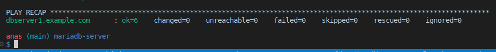
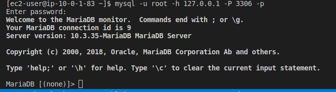

# Configure Mariadb server on RHEL AWS EC2 using Ansible following best Practices

## Best Practices Followed

1. Encrypt `MariaDB` `username` and `password` using `ansible vault`

- `> ansible-vault encrypt vars/secrets.yaml`

2. Specify the default path of `ansible vault` password using `ANSIBLE_VAULT_PASSWORD_FILE` environment variable

- `> export ANSIBLE_VAULT_PASSWORD_FILE=~/.keys/.ansibleSecrets.txt`

3. Use handlers to only set `MariaDB` `username` and `password` once upon installation
4. download `MariaDB` configuration file using `get_url` module

### Screenshots

1. Idempotent Proof

- 

2. MariaDB successful connection proof

- 
